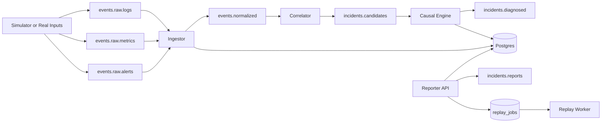

# Ops Commander

Distributed Incident Diagnosis for modern service systems.


Ops Commander does not stop at "an alert fired". It connects signals across services, builds causal context, and produces a report that explains:

- what failed
- why it likely failed
- how the failure propagated
- which competing root-cause hypotheses were considered

## Story in 20 seconds

Imagine checkout failures spike.

Ops Commander links DB latency, service errors, API degradation, and worker backlog into one diagnosis chain.

Instead of "Service X looks red", you get "Failure likely started here, spread through these services, and these are the most likely root causes with confidence."

## At a glance

| Audience | What you get |
| --- | --- |
| Non-technical stakeholders | A readable incident narrative with propagation paths and confidence-ranked hypotheses |
| Engineering teams | End-to-end streaming pipeline, event normalization, correlation, causal graphing, and replay evaluation |
| Recruiters and interviewers | Real runnable system with curated showcase artifacts, not a static slide deck |

## Why this is showcase-ready

- Multi-service diagnosis, not single-service alert aggregation
- Mixed-signal evidence (`metric`, `log`, `alert`)
- Explicit propagation edges and path metadata
- Ranked competing hypotheses with component-level scoring
- Operational endpoints (`health`, `readiness`, `metrics`) and replay workflow

## Architecture



Detailed architecture notes: [docs/architecture.md](docs/architecture.md)

Full docs index: [docs/README.md](docs/README.md)

## Curated sample output

This repo includes a curated distributed-incident artifact bundle:

- [artifacts/showcase/sample_distributed_incident/SHOWCASE_SUMMARY.md](artifacts/showcase/sample_distributed_incident/SHOWCASE_SUMMARY.md)
- [artifacts/showcase/sample_distributed_incident/incident_inc-038827426dfd4958.json](artifacts/showcase/sample_distributed_incident/incident_inc-038827426dfd4958.json)
- [artifacts/showcase/sample_distributed_incident/report_inc-038827426dfd4958.json](artifacts/showcase/sample_distributed_incident/report_inc-038827426dfd4958.json)

Sample highlights:

- `affected_services`: `api-gateway`, `orders-db`, `orders-service`, `worker-service`
- non-empty `how_failure_propagated`
- `signal_coverage`: `alert`, `log`, `metric`
- multiple ranked hypotheses with confidence

Folder guide: [artifacts/showcase/README.md](artifacts/showcase/README.md)

## Quick start (10 minutes)

### Prerequisites

- Python 3.11+
- Docker Desktop

### 1) Install and bootstrap

```powershell
python -m pip install -e ".[dev]"
./scripts/bootstrap.ps1
```

### 2) Start services (6 terminals)

```powershell
python -m apps.ingestor.main
python -m apps.simulator.main
python -m apps.correlator.main
python -m apps.causal_engine.main
python -m apps.reporter_api.main
python -m apps.replay_worker.main
```

### 3) Inject a deterministic distributed incident

```powershell
python scripts/inject_distributed_incident.py --chain-id elite-chain-demo
```

### 4) Capture a showcase bundle

```powershell
./scripts/capture_showcase.ps1 -WaitSeconds 45
```

## Reporter API

- `GET /health`
- `GET /ops/readiness`
- `GET /ops/metrics`
- `GET /incidents`
- `GET /incidents/{id}`
- `GET /incidents/{id}/report`
- `POST /replay/jobs`
- `POST /ingest/alerts/alertmanager`

## Real-world input connectors

- Log file tail to raw logs:
  - `python scripts/feed_logs_from_file.py --file C:/path/to/app.log --service payments-api --follow`
- Prometheus to raw metrics:
  - `python scripts/feed_metrics_from_prom.py --prom-url http://localhost:9090 --service payments-api`
- Alertmanager webhook to raw alerts:
  - `POST /ingest/alerts/alertmanager`

Detailed runbook: [docs/real_world_inputs.md](docs/real_world_inputs.md)

## Reliability and operations

- Retry-backed producer and consumer commits
- Runtime metrics snapshots in each service
- Kafka lag visibility in processing services
- Chaos drills (`scripts/chaos_drill.ps1`)
- Replay evaluation metrics (top-1, top-3, MRR, calibration bins)

Troubleshooting guide: [docs/troubleshooting.md](docs/troubleshooting.md)

## Repository layout

- `apps/simulator`: synthetic telemetry and fault generation
- `apps/ingestor`: validation, normalization, dedupe, quarantine
- `apps/correlator`: event-time windows, cluster linking, candidate emission
- `apps/causal_engine`: causal graph build, ranking, explainable diagnosis
- `apps/reporter_api`: incident/report/replay APIs and ingest endpoint
- `apps/replay_worker`: replay jobs and diagnosis evaluation artifacts
- `libs/common`: shared models, kafka helpers, observability, resilience
- `libs/storage`: SQLAlchemy models and repositories
- `schemas`: versioned event and diagnosis schemas
- `config`: service topology, scenarios, scoring weights
- `scripts`: bootstrap, demo, chaos, ingestion helpers, showcase capture

## Schema contracts

- `schemas/event_envelope_v1.json`
- `schemas/log_event_v1.json`
- `schemas/metric_event_v1.json`
- `schemas/alert_event_v1.json`
- `schemas/incident_candidate_v1.json`
- `schemas/diagnosis_v1.json`

Regenerate schema files:

```powershell
python scripts/export_schemas.py
```
