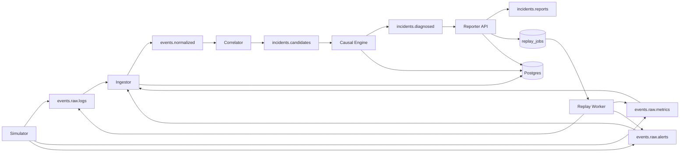
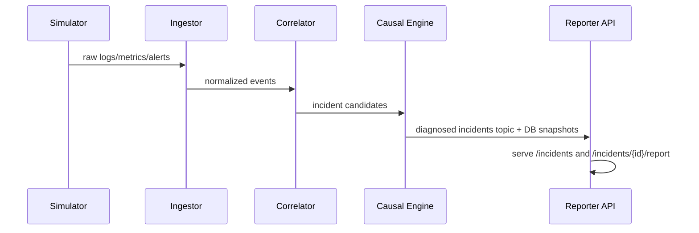

# Architecture and Operations

## Runtime Topology

## Sequence for Live Diagnosis

## Hardening Features

- Retry-backed produce/commit in stream consumers/producers
- Per-service runtime metrics snapshots (processed, dropped, errors, retries, avg latency)
- Kafka lag snapshots for consumer services
- Optional chaos drop-rate injection in simulator/consumers
- Replay and API operational endpoints for runtime introspection
